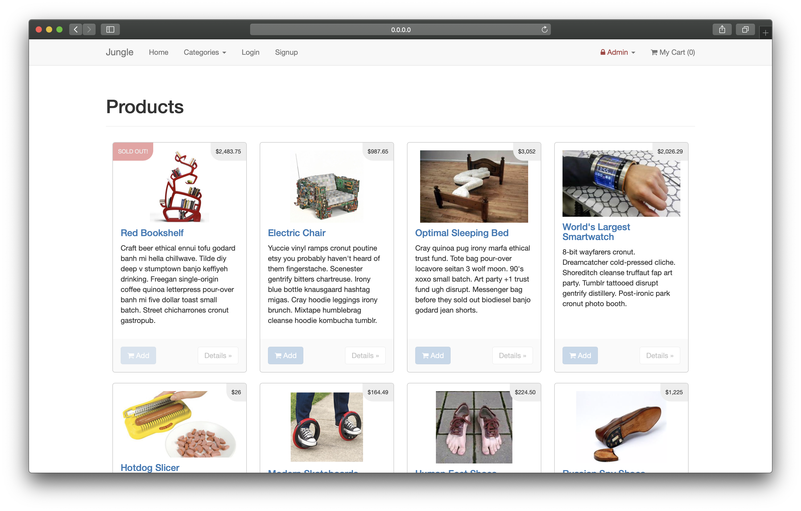
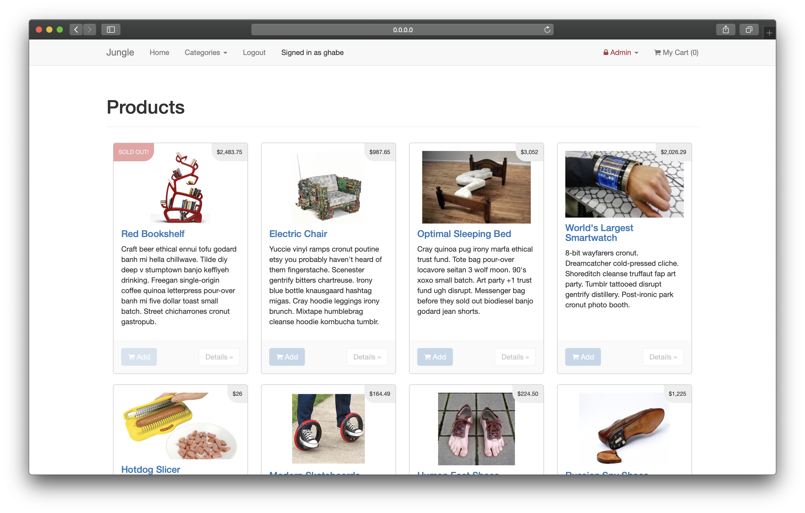
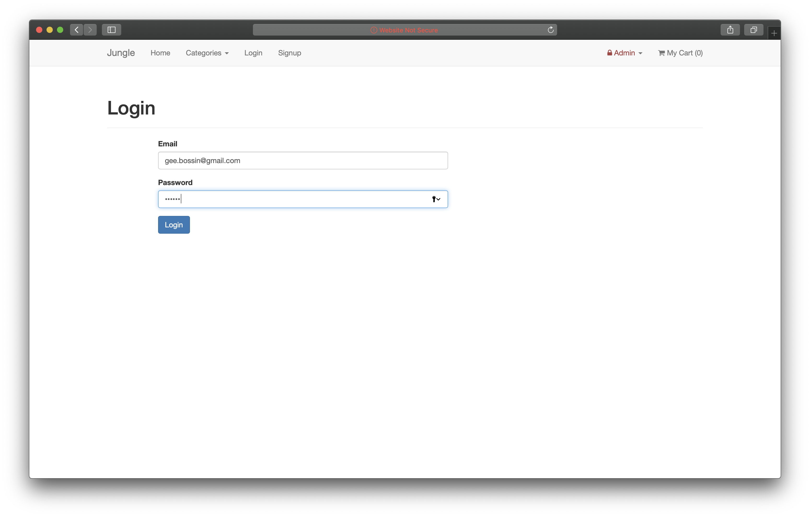
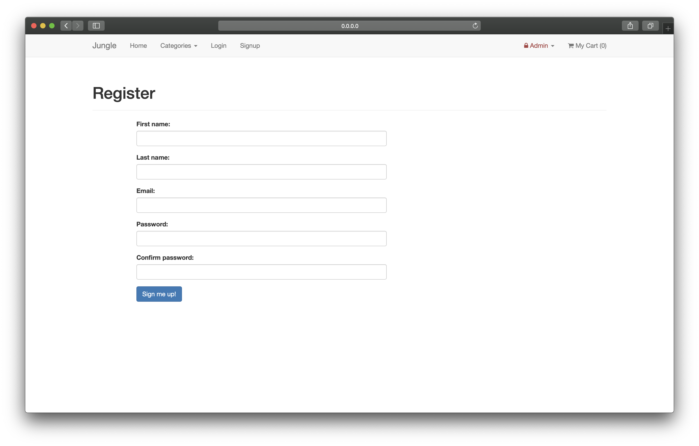
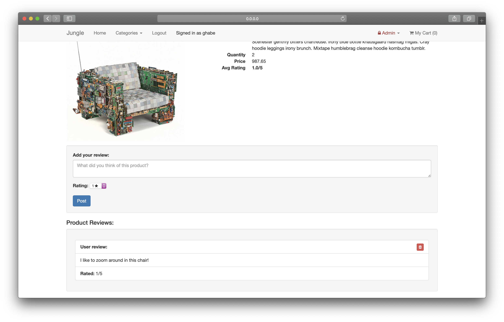
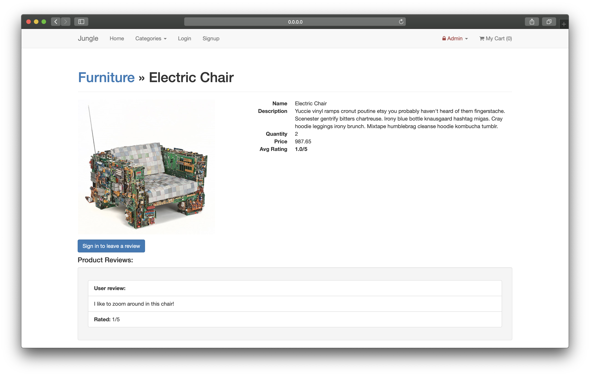
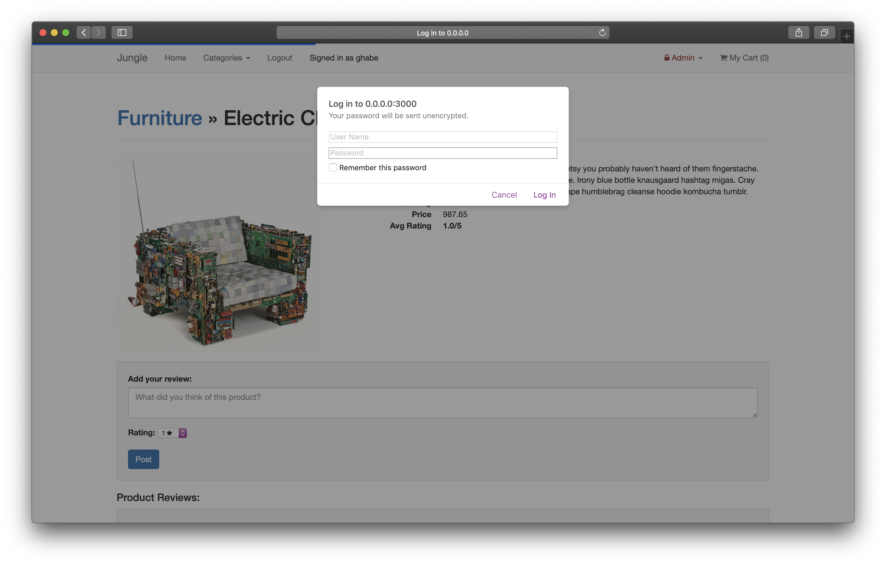
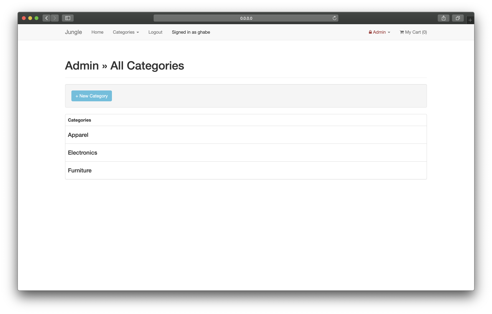
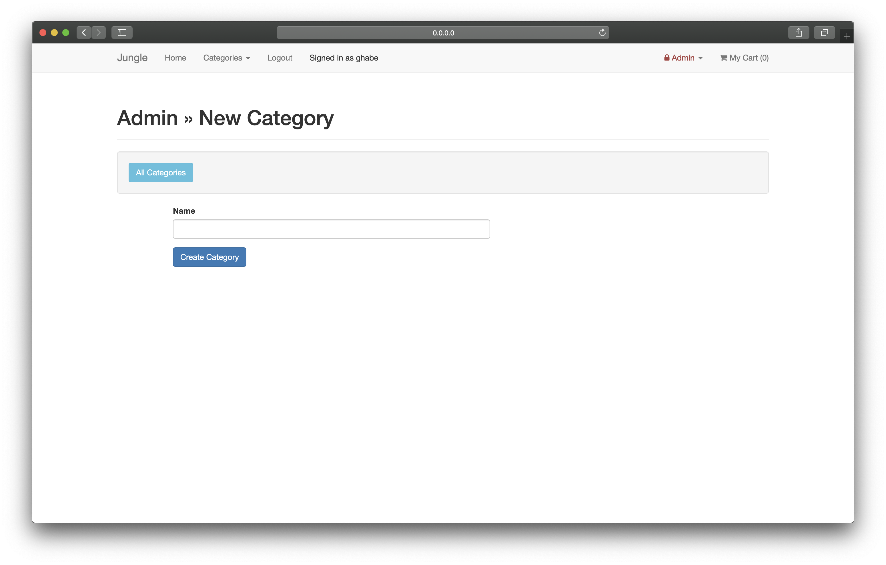

# Jungle

A mini e-commerce application built with Rails 4.2 for purposes of learning Rails at Lighthouse Labs, week 7.

## Features

* Sold out badge on out of stock products
* Users can register and login/out
* If cart is empty, user is prompted with an option to continue shopping.
* Logged in users can rate and review products, and delete reviews they posted.
* Shows order confirmation on purchase
* Email order reciept
* Admin authentication
* Administrators can add new categories

## Examples

## Setup

1. Fork & Clone
2. Run `bundle install` to install dependencies
3. Create `config/database.yml` by copying `config/database.example.yml`
4. Create `config/secrets.yml` by copying `config/secrets.example.yml`
5. Run `bin/rake db:reset` to create, load and seed db
6. Create .env file based on .env.example
7. Sign up for a Stripe account
8. Put Stripe (test) keys into appropriate .env vars
9. Run `bin/rails s -b 0.0.0.0` to start the server

## Stripe Testing

Use Credit Card # 4111 1111 1111 1111 for testing success scenarios.

More information in their docs: <https://stripe.com/docs/testing#cards>

## Dependencies

* Rails 4.2 [Rails Guide](http://guides.rubyonrails.org/v4.2/)
* PostgreSQL 9.x
* Stripe
